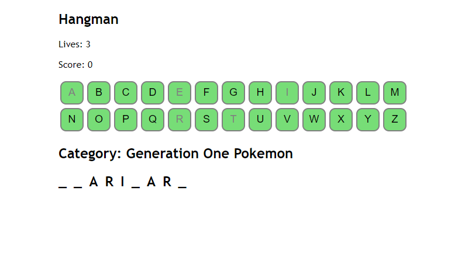

# Hangman

## Description
A game of Hangman. Guess a the hidden word by either clicking on the letter buttons or by using your keyboard. Be careful, you're only allowed 5 wrong guesses per round.

# Link to deployed website:
https://roan1088.github.io/hangman/

## Table of Contents
- [Project Status](#project-status)
- [Credits](#credits)
- [License](#license)
- [Contributing](#contributing)
- [Questions](#questions)

## Project Status
The project is still under development. The game currently does not utilize the score system yet. Also the game only has one category. I will be adding more soon when I can and when I find some good APIs.

## Credits
This project uses [PokéAPI](https://pokeapi.co/) to receive names as words used for the game.

## License
This project is licensed under the MIT license.

## Contributing
Nothing

## Questions
If you have any questions about the repo, open an issue or contact me directly at rohan_188@yahoo.com. You can find more of my work at [roan1088](https://github.com/roan1088).